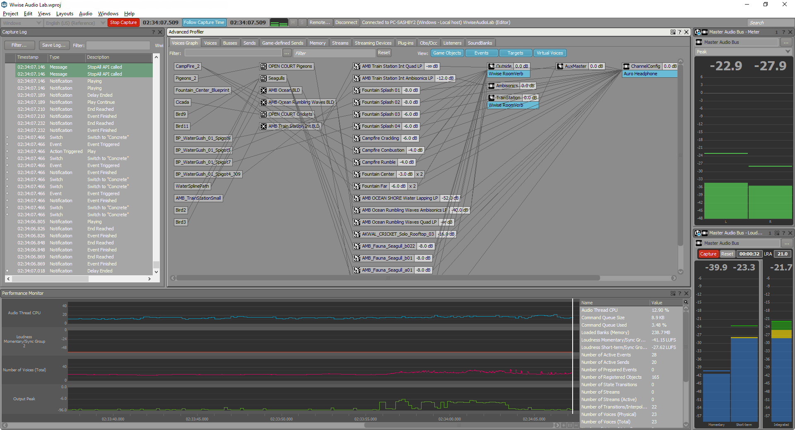
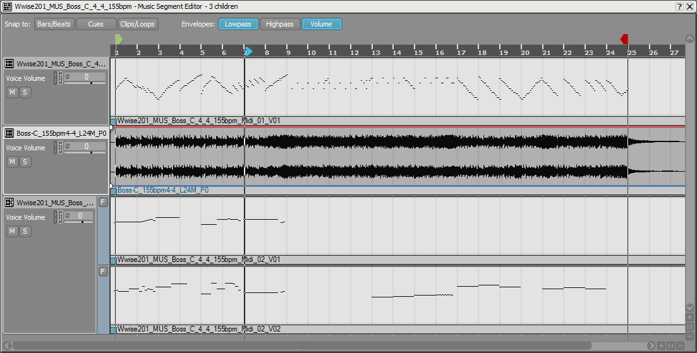
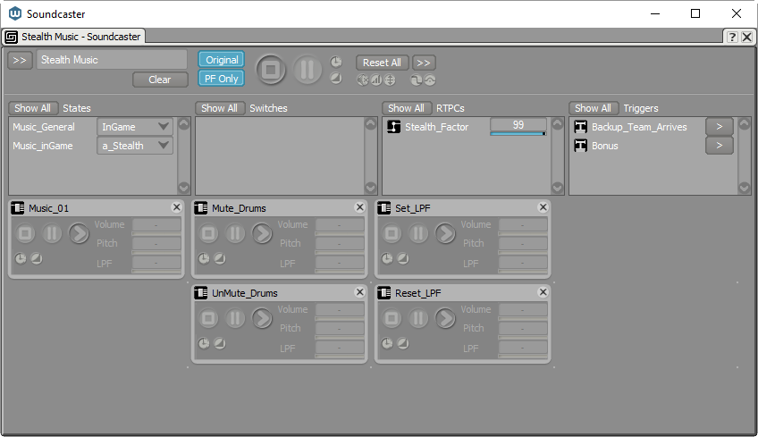
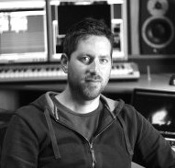

# 为什么要用 Wwise ？
游戏音频圈里老有这么一个问题：我该怎么跟老板和客户解释中间件到底有啥好处？从我们音频从业者阵营这边来看，好像这是个想都不用想的问题。但现实中要想答好这个问题，我们还得从客户的角度出发。为什么有时候不用中间件也有可能完成工作时，客户还需要为中间件掏腰包？对比成本，收益能否说得过去？如今的游戏开发版图中，越来越流行采用 Unreal 或者 Unity 一体化解决方案中的自带音频功能，特别是对很多资金紧张的小独立团队来说。我们音频从业人如何能说服人为了专门的声音引擎投资呢？

从负责筹划项目的制作人或者工作室总监的角度来看，授权费用是有闲钱时才舍得花的开销。假设有一个（北美地区的）单平台项目，开发预算在 15 万美元到 150 万美元之间，即对应 Wwise 的 B 级授权，授权费为 6 千美元。这个例子中，采用 Wwise 差不多相当于一个高级员工或者“一个半”初级员工几个月的工资。可能花了这个钱意味着要少做一个特性或者少做一点素材。但是重点在于权衡。为了证明钱花得值，你需要展示天平的另一端比这些顾虑要来得更重要，站在高处来看，花这个钱既能提升质量还能节省时间，而且事关声音设计师和程序员两个群体。

如果购买 Wwise 的成本等于招一位音频程序员干一个月，而实际上用起来却节省了一位音频程序员两个月的时间，这个数字本身就有说服力了。用了 Wwise，你已经成功地让制作人花了一点资源在 Wwise 上却空出了许多资源，这样项目结余反而有了提升。

换句话说，我们在推广一个特性或者解释收益的时候，需要站在听众角度上自问自答：“这个特性如何节省时间，提升质量？”具体答案显然要看具体的项目，要看需求和所选引擎的基本特性，但这里给出一篇综述，讲讲 Wwise 的功能是如何能节省时间和提升质量的。

## 设计流程

大多数声音设计师在用 Wwise 的时候都在和设计工具（authoring application）打交道。从创意工作上来讲， Wwise 的设计流程提供了一组强大的特性并提供了一套声音设计师能理解的语言。例如，用分贝来表示的音量，总线混音层级结构，包络，LFO，以及能可视化编辑的参数曲线。这套语言和 DAW 和采样器里用的语言相通, 声音设计师使用起来因此快捷而准确。 第二，从游戏对象中分出音频功能大大降低了对项目里文件的依赖，在大量的工作中可以不必去修改场景或地图文件、GameObjects 或者blueprints，因为其它团队成员可能也要用这些资源。这样不仅省了声音设计师的时间（这些时间最终都会花到质量上去，少花时间折腾 blueprints 和版本控制、少排队等操作文件意味着能多花时间让游戏更好听！），还省了团队其他成员的时间。

## 创意特性

在设计和实现音效方面（稍后我们会谈到语音和音乐），Wwise “砰砰”跳的心脏是 [Actor-Mixer Hierarchy](https://www.audiokinetic.com/library/edge/?source=Help&id=adding_objects_to_actor_mixer_hierarchy)（角色混音器）以及其[容器类型](https://www.audiokinetic.com/library/edge/?source=Help&id=grouping_sound_and_motion_objects_to_create_actor_mixer_hierarchy_types_of_containers)－Random（随机），Blend（混合），Switch（切换）和 Sequence（序列）。用这四个容器类型（彼此还可发挥想象力随意嵌套组合)，我们可以构建极为多样的声音行为，从最重要和最基本的比如从一队声音变体中随机挑选一个，一直到高度复杂的层叠和动态的声音构建。 在此基础上我们还可以定义 [Real-Time Parameter Controls (RTPCs)](https://www.audiokinetic.com/library/edge/?source=Help&id=working_with_rtpcs_overview)，[Switches](https://www.audiokinetic.com/library/edge/?source=Help&id=working_with_switches_working_with_switches) and [States](https://www.audiokinetic.com/library/edge/?source=Help&id=working_with_states_overview), 从而让游戏发送这些变量并将它们映射到种类繁多的声音属性上去。

拿脚步声来举例。如果一个角色需要针对 5 种不同的地表材质和 3 种不同的速度来配脚步声，我们可以自底向上地组装一个结构，这么用: 用 Random Containers 来装对应各种排列组合的样本，比如 Grass/Walk（草地／走）和 Grass/Run（草地／跑）; 用 Blend Containers 或 Switch Containers 将各个排列组合映射到一个叫“speed”的参数或者Switch; 并用一个顶层 Switch Container 来在材质间切换。这一套可以几分钟就组装好。程序那边只需要为每个脚步发送一个叫“play footstep”的 Event（事件），并在“material”和“speed”值起变化时发送这些值。

这里还有一个例子。武器声可能会含一个起音和一个尾音，还有一个“机制”层得要仔细听才听得到，每部分都要有变体。这可以用 Blend Container 来组装，集合 3 个 Random Containers，再稍微给机制层一个变化的时间延迟。同样，这只要几分钟就可以搭好，而且只用一个 Event 就可以触发。

要从头实现这些行为需要花时间还要测试，而且最后做出来的东西速度上不太可能赶得上 Wwise 设计工具 UI 的快捷。相信我，我用 Unity 做过这个所以我知道！你可能在实现这些基本容器类型的过程中就已经花了差不多一个 B 级授权的成本了，而且最后很可能跟 Wwise 相比流程上还是不太顺畅，功能还是很有限。

## Profiler

Wwise 最强大的特性之一是其 [Profiler（性能分析器）](https://www.audiokinetic.com/library/edge/?source=Help&id=game_profiler_game_profiler)。Profiler 可以在游戏运行的时候把设计工具连接到游戏中去，并监视声音引擎里的一切活动。游戏中新来的 Events 及其引发的 Actions（动作）可以实时显示，这些动作包括比如声音的开播和停播，或者音量变化和定位信息。还可以显示错误信息、参数值和资源占用。这个工具用来调试和优化简直妙极了，可以节省巨大的时间，帮助我们快速弄清声音有没有在按计划运作，如果没有，原因又是什么。

所有一线游戏引擎自带的音频工具里没有能与其相提并论的，而且要自己实现 Profiler 能做的事情会很困难，代价会非常高。这里的问题不在于“要花多大代价去实现这个工具？”而是“不用这个工具会造成多大代价？”遇到一个 bug，用 Profiler 的话，声音设计师可以快速诊断并修正；否则会经常需要程序员帮忙和进行花费更大的 QA 测试，声音设计师修正起来也往往更花时间。因为在项目中可能会碰上很多这样的 bug，所以合理估计一下，Wwise 会省掉至少好多天甚至好多个星期的工作。

 

## 实时编辑

当设计工具连接到游戏中的时候（跟 Profiler 用的同样的连接），我们可以实时编辑。这样就可以边玩游戏边做混音和微调了。跟有些游戏引擎实时编辑的做法不一样，用 Wwise 做的实时调整在会话结束后可以保存下来，这对混音调节电平这样的工作来说太宝贵了。这还意味着我们可以就地微调 RTPC 映射、距离衰减、效果器发送、时间属性、混合以及很多其它的声音属性和行为。这可以大大减少声音设计师迭代需要的时间，并且提高混音和调节的精确度，最终帮助我们提升质量。

## 动态混音

Wwise 还提供了许多方法来[动态控制混音](https://www.audiokinetic.com/library/edge/?source=Help&id=using_advanced_settings_and_dynamic_mixing)，响应游戏中的 Events、States 以及任何时候的播放内容。High Dynamic Range（HDR，高动态范围）可以让混音自适应播放内容的响度，让音量小的声音来给音量大的声音腾出空间以进一步提升后者的听觉响度。States 可以改变总线音量、滤波或者效果器。也可以用 Ducking（闪避），鼠标点选几下就可以设好。

虽然基本的基于声音类型的 ducking 系统自己来实现可能比较简单，但用电平表驱动的 ducking（[Side-Chaining，旁链](https://www.audiokinetic.com/library/edge/?source=WwiseProjectAdventure&id=auto_ducking_vs_side_chaining)）和灵活的 State 混音却并不容易实现，HDR 实现起来则是尤其的复杂。如果需要这些特性，不用 Wwise 来自行实现所花的时间可能要按周而不是按天来算。

## 互动音乐系统

大多数游戏都需要某种形式的[互动或者动态音乐](https://www.audiokinetic.com/library/edge/?source=Help&id=understanding_interactive_music_understanding_interactive_music)，这是游戏引擎支持里面最薄弱的环节。Wwise 的解决方案足够灵活，可以支持任何手段，提供精确到采样点的同步和定制自由度非常高的过渡行为。系统由 State 来驱动，这意味着只需要在游戏或关卡开始时启动音乐系统，然后按需要去设置 States 就行了。

要自行实现一个互动音乐播放器，哪怕只是实现 Wwise 功能、时间精确度（对音乐同步至关重要）和易用度中的一小部分都很可能要花掉程序员好多个星期的时间。

 

## 本地化支持

和互动音乐一样，大多数游戏引擎对[语音本地化](https://www.audiokinetic.com/library/edge/?source=Help&id=localizing_project)的支持也不够好。相比之下，Wwise 让本地化变得很简单。你只需要把素材拖到 Wwise 里，保证名字匹配并在导入对话框里设定语言就可以了。从程序角度来看，只需要调用一个函数来设置语言。

## 平台支持

跨平台开发是游戏引擎的强项，而且这也包括了音频部分。然而 Wwise 还是能提供一点优势，它能通过 ShareSets（见下文）在宏观和微观层面上全面控制[压缩和格式转码](https://www.audiokinetic.com/library/edge/?source=Help&id=creating_audio_conversion_settings_sharesets)，这个宝贵的功能让针对各个平台的内容优化变得快捷有效。

## Soundcaster / Prototyping

Wwise 的设计中始终有一条核心原则，那就是让声音设计师对声音行为的控制权达到最大，而对游戏代码的依赖降到最小。当开枪时，游戏只需要给 Wwise 发一个 Event，之后发生的一切，比如层叠、随机化、序列化声音组分或者影响别的声音全都掌握在声音设计师的手中。

声音设计师用 Soundcaster（声音选角器）可以离线测试这些声音行为，模拟游戏输入，这种模拟可以在集成到游戏中去之前或者比游戏有更强限制的对照条件下进行。所以，解除了音频和程序之间依赖关系也就保证了在编程之前就能够测试设计。结果就是我们可以在快速原型开发环境中清晰地验证声音行为是否正确，而避免了代价更大的程序迭代。
 

## ShareSets

[ShareSets（共享集）](https://www.audiokinetic.com/library/edge/?source=Help&id=sharesets_tab)可能属于 Wwise 中最不引人注目却很值得关注的特性之一。ShareSets 本质上是可复用的设置模版，用于 Attenuations（衰减），Modulators（调制器），Effects（效果器）和 Conversion Settings（转码设置）。听起来可能不够性感，但是关键在于：声音设计师用了 ShareSets 就既能在宏观上做地毯式修改，也能仔细调整细节，而且效率极高。

平台优化是一个很好的例子。假设我们的游戏准备发售了，但是 PS4 的 SoundBanks 超出了内存预算，那我们怎么来砍掉要求砍掉的 4MB 占用呢？使用 ShareSets，我们可以对所有平台调节压缩设置。或者我们还可以为一整个类别的声音创建一个自定义设置来做高一些或者低一些的压缩，降低采样率，或者甚至强制转换为单声道来均衡质量和内存占用。

用同样的方法，我们也可以对大小各异的声音类别[应用衰减设置](https://www.audiokinetic.com/library/edge/?source=Help&id=applying_attenuation_instances_to_objects)，保证我们在一处做的改动可以对所有想要的地方都生效。

时间、效率和项目管理上的好处是巨大的。主要的得益者是声音设计师。有了 Wwise，声音设计师可以把所有时间都注入完善音频质量当中去，而不用蹚过众多的设置来调节、测试、再调节。

 

## Conclusion

所以，“总体上 Wwise 能给项目带来什么好处呢？” 综上，采用 Wwise 能让声音设计师节省大量的时间，建立高效的工作流程，并且把时间花在为产品增添价值的目标上，比如创造内容并让项目更好听。Wwise 还能减少编程时间，把控制权和实现创意特性的自由交到声音设计师的手中。这意味着它能解放很多个星期甚至很多个月的编程人力资源，而把时间花在最值得花的地方：让你的项目达到最好。

CIARAN WALSH
总监 - Hornet Sound

Ciaran 是一位声音设计师、程序员和作曲，有 16 年的业界经验。他目前的项目包括饱受赞誉的太空战游戏《Fractured Space》（破碎空间）。他曾是经典小众互动音乐解谜游戏《Chime》（奇幻乐钟）的作者。
