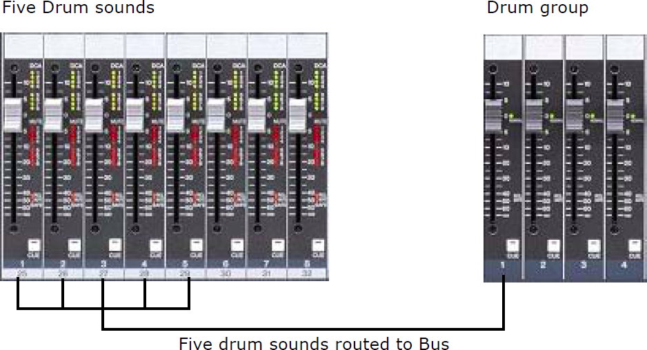
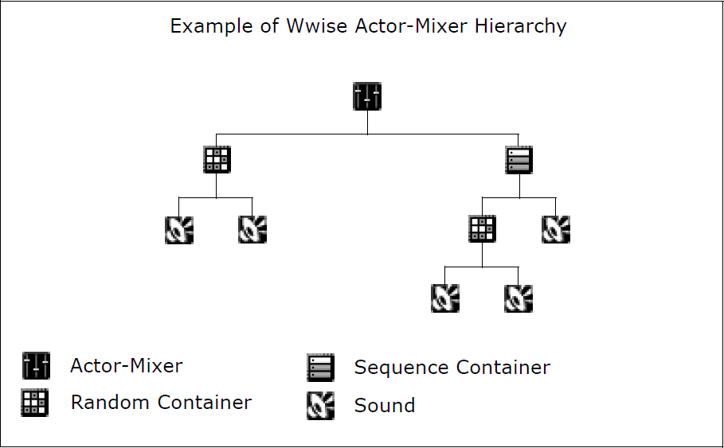
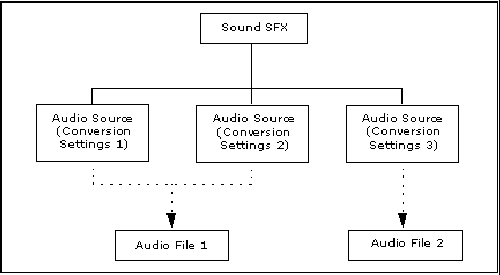
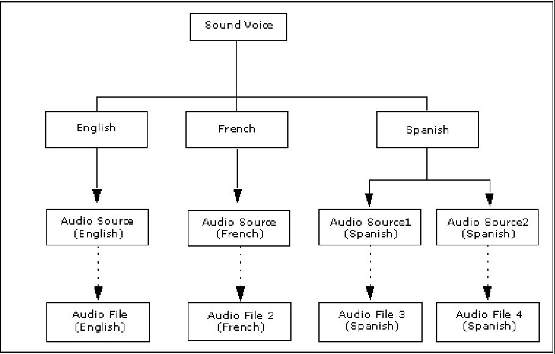
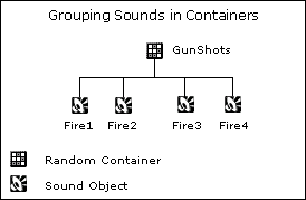
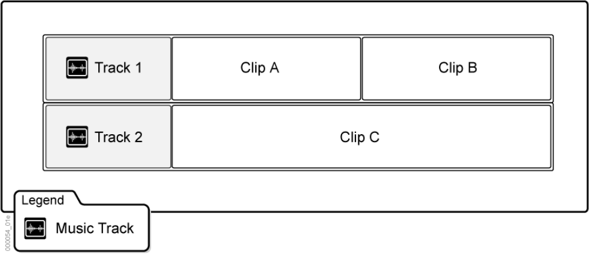
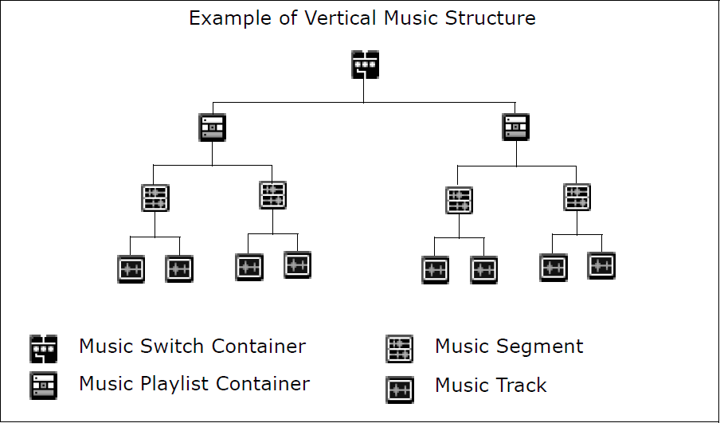
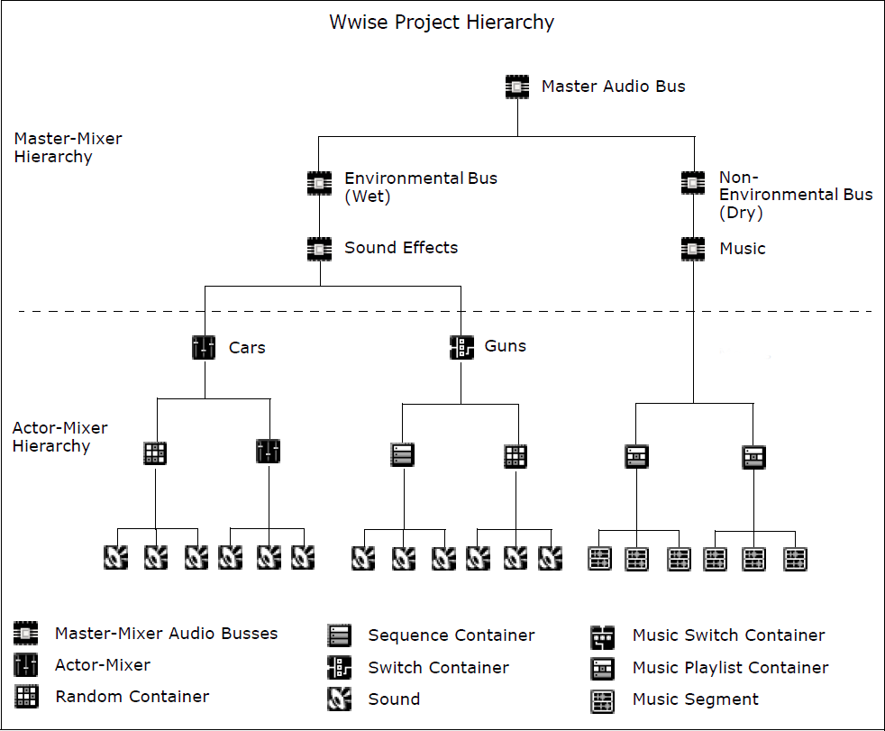

# Wwise 基础知识 (3) 工程层级结构

目录

- 工程层级结构
- 理解 Actor-Mixer Hierarchy
- 音频对象
- Source 插件
- 构建音频对象的层级结构
- 音频对象——角色和职责
- 理解 Interactive Music Hierarchy
- 理解 Master-Mixer Hierarchy

## 工程层级结构
导入工程中的素材是工程层级结构的基础。工程层级结构从传统混音技术演化而来。在传统混音技术中，通过将不同乐器的通路指派到一条总线，您可以将它们的声音属性作为一个混音进行控制。例如，可以将踩镲声、击镲声、碎音钹声、底鼓声和军鼓声的通路全都指派到一条总线，您可以将它们将它们混合后作为一个整体来控制其音量和其他参数。

Wwise 中采用类似的方法对工程中的声音、振动（motion）对象和音乐进行组织和分组。通过采用这种方法对声音、振动和音乐对象分组，您即开始创建层级式项目结构，在各种对象之间创建主从关系。这种创建和管理游戏音频和振动的独特高效方法可以为您创建具有真实感的沉浸式游戏环境提供更大的控制权和灵活性。

Wwise 工程层级结构包括三个不同的级别：

- Actor-Mixer Hierarchy（角色混音器层级结构）——使用一系列 Wwise 专用对象来
分组和组织工程中的所有声音和振动素材。
- Interactive Music Hierarchy（互动音乐层级结构）——使用一系列 Wwise 专用对象
来分组和组织工程中的所有音乐素材。
- Master-Mixer Hierarchy（主混音器层级结构）——使用一个或多个输出总线定义不同声音、振动和音乐结构的连线和输出。

### Wwise 工程层级结构支持工作组
在当今游戏开发环境中，团队协作至关重要。虽然每个游戏只可使用一
个 Wwise 工程，但是您可以将 Wwise 工程层级结构划分为不同的工作单元，这样不同的人员就可以同时参与工程。Work Unit（工作单元）是特殊的 XML 文件，其中包含与工程中某一特定部分或元素有关的信息。这些 Work Unit 可帮助您组织和管理工程中的各种元素。如果您参与团队协作，这些Work Unit 还可以由版本控制系统来管理，团队中的不同成员可以更加容易地同时参与工程。

## 理解 Actor-Mixer Hierarchy

Actor-Mixer Hierarchy（角色混音器层级结构）用来分组和组织工程中的所有声音和振动素材。层级结构的最底层是所有单独的声音和振动对象。您可以定义这些单独对象的属性和行为，还可以将这些对象组合在一起，作为一个整体来定义它们的属性和行为。考虑到游戏中音频的复杂性，Wwise 工程层级结构中允许同时存在多种不同的对象。每种对象都有一组属性（例如音量、音高和位置）和一组独特的行为（例如随
机或顺序播放）。通过使用不同的对象类型对工程层级结构中的声音分组，可以对游戏中的声音组定义特定的播放行为。您还可以在层级结构中的不同层次上来定义这些属性和行为，以此获得不同的结果。

由于振动一般绑定到游戏的音频上，因此 Wwise 采用相同的原理和工作流程来生成振动。这意味着您可以使用层级结构来组织游戏的振动素材，并采用与音频素材相同的方式来指定属性和行为。

您可以组合使用以下对象类型来对素材分组和为工程搭建结构：

- Sound Object（声音对象）
- Motion FX（振动效果）对象
- Container（容器）
- Actor-Mixer（角色混音器）

## 音频对象
在 Wwise 中，游戏中的各种语音和 SFX（音效声）素材用音频对象（Audio Object）来表示。音频对象是一种特殊的音频对象。这些声音对象包含链接到原始音频文件的源（source）。

音频源是导入的音频文件与声音对象之间的独立层。通过添加这样的抽象层，您可以将多个源和音频文件全部置于同一个声音对象之中。

这不仅便于测试不同的转码设置，而且可以高效地管理多语言版本的开发。

注意：Wwise 采用类似的方法管理工程中的音乐和振动素材。

## Source 插件
声音对象不仅支持音频源（Source），而且还支持插件源。

Wwise 配备各种各样的源插件，包括Tone Generator（乐音生成器）、Silence（空白）和Audio Input（音频输入）插件。它们除了可以直接用于制作管线外，其主要用途是与随附的源代码一起，供程序员创建自己的源插件时作为参照。由于音频对象的创建和管理由声音设计师在 Wwise 中完成，现在程序员可以解放出来，自由地开发各种源插件，突破音频设计的极限，提升游戏的总体体验。

## 构建音频对象的层级结构
音频对象可以组合起来创建层级式的工程结构。音频属性和行为可以应用于层级结构的不同级别，为您提供创造真实沉浸式游戏体验所需要的控制权和灵活性。在工程中，容器用来对声音对象分组。它们主要用于根据特定行为（例如随机、顺序、切换等）来播放一组对象。例如，可以将所有枪击声集中到一个随机容器中，以在游戏中每次开枪时播放不同的声音。

所有音频对象被连线到总线层级结构中后，还可以在总线上作为整体来附加属性和效果。


## 音频对象——角色和职责
下表说明了与音频对象相关的哪些任务属于声音设计师的职责，哪些属于程序员的职责：
### Table 3.1. 音频对象——角色和职责
| 任务    | 声音设计师 （Wwise）| 程序员（游戏代码/工具）  |
| ------------- |:-------------:| :-----:|
| 为游戏音频素材创建声音对象 | ＃ | |
| 对对象进行分组和构建工程层级结构 | ＃      |  |
| 定义声音属性和行为 | ＃ | |
| 通过总线为音频对象连线 | ＃ | |
| 开发 Source 插件 |  | ＃ |

## 理解 Interactive Music Hierarchy
在为工程创建互动音乐时，Wwise 可以为您提供高度的灵活性。有无数种方式可以将互动音乐对象汇编成游戏配乐。然而，在结构上保持一致性可以让工作流程变得更加高效。

以下是可用于互动音乐工程的两种基本结构：

- 横向工程结构。在这种工程结构中，您可以通过打乱音乐段落中包含的音轨来对游
戏配乐进行重新排序。它类似于音乐制作中使用的音轨混音，可以帮助您利用多轨
长段落制作多样化的配乐。

- 纵向工程结构。在这种工程结构中，您可以在既定时间点上动态选择所要播放的段落来令游戏配乐多样化。为此，您可以像排列 Actor-Mixer Hierarchy 中的对象一样来排列 Interactive Music hierarchy 中短的离散段落。通过这种方法，您可以使用精选的短音乐段落制作极具感染力的配乐，同时尽可能降低游戏机的性能需求。

一般您需要组合使用这两种结构，以便高效地利用工程中可以使用的资源。一个好的结构可以让您制作出动听的音乐，并充分利用游戏机资源。

## 理解 Master-Mixer Hierarchy

Actor-Mixer 和Interative Music Hierarchy之上是 Master-Mixer hierarchy （主混音器层级结构）。Master-Mixer hierarchy 是独立的总线层级结构，可以让您重新编组和混合工程中的大量不同声音、音乐和振动结构，让它们可以输出。Master-Mixer hierarchy 分为两个部分：一个部分为声音和音乐，另一个部分为振动。每个部分包括一个顶级“Master Bus”（主总线）及其下层的任意数量的子总线。

您可以选择使用游戏中的主要音频种类作为总线，并通过它们为声音、音乐和振动结
构连线。例如，可以将所有不同的音频结构分成以下四种类别：

- Voice（语音）
- Ambience（氛围）
- Sound Effect（声音效果）
- Music（音乐）

这些总线不仅为工程中的声音、音乐和振动结构创建最终控制级别，而且还可以确定哪些声音受到环境效果的影响，例如混响。由于它们位于工程层级结构的顶端，因此您可以使用它们为游戏创建最终混音。根据平台情况，也可以在总线上添加特定效果（包括环境效果），以此来创建游戏所需要的沉浸式体验。

您还可以使用音频总线结构来排查游戏中的故障。例如，可以单独播放特定语音、环境声音或声音效果总线来辨别特定的声音或音乐。

下图为 Master Audio Bus（主音频总线）层级结构的示例。其中首先使用两条总线来初步区分环境声音和非环境声音，然后使用多条其它音频总线对 Actor-Mixer hierarchy 中的部分声音结构和 Interactive Music Hierarchy 中的部分音乐结构重新编组。

### 小贴士
在 Master Motion Bus（主振动总线）下，可以同样为工程中的所有振动结构创建类似的层级结构。

