# 游戏音频中间件：整合 Unity 和 Wwise


**作者：**Alexander Hodge  
**作者主页：**http://anor.ac  
**原文链接：**http://anor.ac/?page_id=93  
**版权说明：**本文所有内容由原作者授权 Audiokinetic 翻译、转载并转存部分文件供镜像下载

蒙特利尔的公司 [Audiokinetic](https://www.audiokinetic.com/) 开发了流行的游戏音频中间件 Wwise。我特别写下本文来帮助 Unity 开发者将 Wwise 整合到游戏项目中，文中提供详细步骤和示例素材。

## 预览

在下面的视频中你可以观看本文用到的示例游戏的玩法并试听最终音频效果。

<embed src="http://static.video.qq.com/TPout.swf?vid=c0309n8qvtk&auto=0" allowFullScreen="true" quality="high" width="480" height="400" align="middle" allowScriptAccess="always" type="application/x-shockwave-flash"></embed>

[视频链接](http://v.qq.com/page/c/t/k/c0309n8qvtk.html)

## 综述

本文将涉及 Wwise 的以下功能点，权当 Wwise 潜能的一碟开胃菜：

- Wwise 编辑器的视图和术语
- 事件（Event）
- 游戏同步器（Game Sync）如 State
- 共享集（ShareSet）
- 互动音乐
- 用音频总线（Audio Bus）混音

[下载本文配套音频素材（6.7 MB）](http://anor.ac/downloads/Audio%20assets.zip)  
[下载镜像](https://yunpan.cn/cR4w2xYwxvFXa)（提取码：f638）

本教程采用Unity 官方示例工程`Survival Shooter`的修改版本，游戏可以从 [Unity 素材商店](https://www.assetstore.unity3d.com/en/#!/content/40756)免费下载。这是一个没有尽头的枪战场景，其中有三种敌人、一种武器还有一些音效和音乐。我们要利用 Wwise 来替换掉这些音效和音乐。

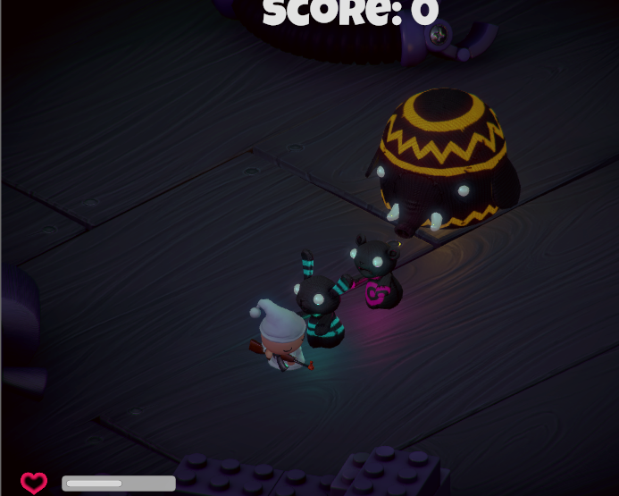

## 第一步 － 用 Wwise 来制作声音

在这个 Unity 工程的根目录（里面有`Assets`目录）下，新建并保存一个 Wwise 工程，在这个过程中要保证选中了合适的平台，本例中用的是 Mac 平台。工程新打开的时候会启动`Designer`布局（`F5`键）。

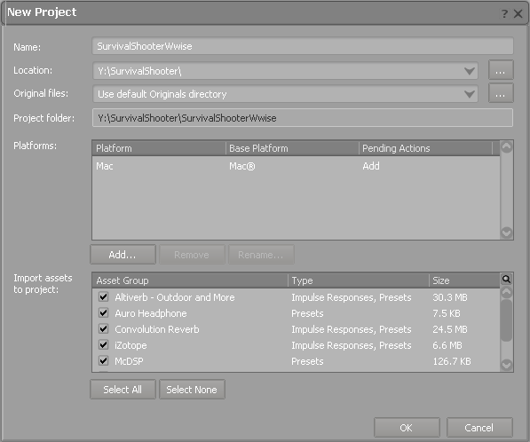

前往`Project Explorer`（工程浏览器）视图的`Audio`选项卡，它默认位于 Wwise Authoring Editor （译注：即 Wwise Authoring Tool， Wwise 设计工具）的左上区域。在`Actor-Mixer Hierarchy`（角色混音器层级结构） 中右击叫作`Default Work Unit`（默认工作单元） 的对象并选择 `Import Audio Files ...`。这个 Actor-Mixer Hierarchy 是 Wwise 中的一个结构，它包含了游戏项目中所有的音效。从示例素材中选中并添加`rifle_shot.wav`这个文件，在`Object Type／Action`列选中`Sound SFX`（音效对象）。***小技巧：一个很有用的导入操作快捷键是`Shift＋I`。***

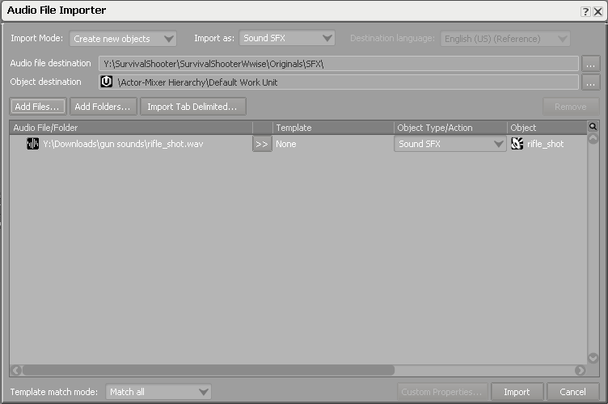

这是我们要用在枪声上的唯一文件。选中`rifle_shot`SFX 对象后，你可以按下空格键试听一下效果。编辑器底部`Transport Control`（播放控制）的标题栏中会显示选中对象的名称。你还会注意到选中 SFX 对象后，界面会自动更新，显示出这个对象的 `Sound Property Editor`（属性编辑器）和`Contents Editor`（内容编辑器）视图。让我们运用`Sound Property Editor`来给步枪枪声一点随机变化吧！

让`rifle_shot`对象保持选中状态，双击`Pitch`属性下的小圆圈图标，接着`Randomizer`（随机化器）视图打开了。启用 Randomizer，并将`Min`和`Max`值分别设为-150和150，单位是音分，半音音阶中相邻半音间的音程是100音分，所以我们相当于给`rifle_shot`对象的`Pitch`属性增加了正负1.5个半音的随机化范围。这样做能让声音更多样一些，避免产生令人心烦的重复音效。

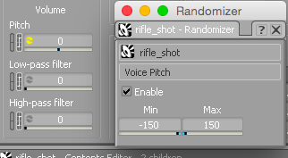

再试听几次`rifle_shot`SFX 对象，你会听到音高有了随机变化。恭喜，你已经学会使用 Wwise 中的第一块积木 － SFX 对象了！

## 事件：连接 Unity 和 Wwise

我们现在已经能在 Wwise 中播放声音了，但如何才能在`Survival Shooter`游戏中当玩家开枪时播放`rifle_shot`这个 SFX 对象呢？答案是事件（Event），这是让游戏触发 Wwise 对象来做事的一种方法。我们现在要添加一个名为`PlayerShoot`的事件，每当玩家的武器打响时，游戏代码就会调用这个事件。

切换到`Project Explorer`视图中的`Events`选项卡。右击`Events`文件夹中的`Default Work Unit`并选择`New Child`>`Play`。给这个新创建的 Event 取名为`PlayerShoot`。***注意：Event 名称的字符串必须要和文中所述吻合 － 我们要从游戏代码里依据名称来调用这个 Event。***

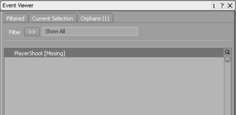

你可能已经注意到了`PlayerShoot`事件已经自动加到`Event Viewer`里去了，这个视图就在`Project Explorer`视图下方。你可以在两个视图中的任何一个里点击`PlayerShoot`事件。上一步中已经创建了一个 Play Event，Wwise自动给这个事件的`Event Action`（事件动作）列表中添加了一个`Play`动作。然而它还少了一个对 Object 的引用 － Wwise 现在还不知道当这个 Event 被调用时应该播放什么声音。你可以右击该列，选择`Browse…`，再从`Actor-Mixer Hierarchy`中选中`rifle_shot`这个 SFX 对象。

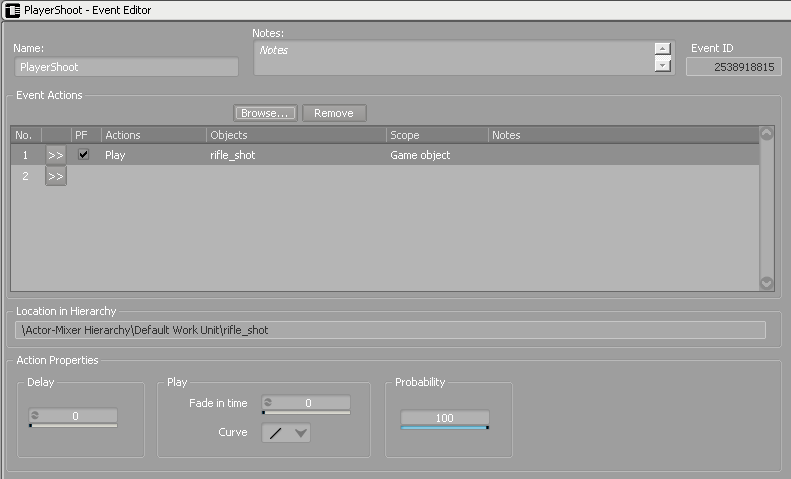

你可以按照试听`rifle_shot`对象的同样方法来试听`PlayShoot`事件，方法是在`Event Viewer`中选中这个 Event 并按下空格键。现在我们知道如何新建 Events 并把 Actions 添加到对象上去了。我们已经差不多准备好从游戏代码中调用这个 Event 了，只需要做最后一件在 Wwise 中非常重要的事情 …

## 生成 SoundBanks

SoundBanks 是来装载 Wwise 中你要创建的所有内容的容器，包括 SFX 对象，Events 等等。游戏要加载的不是别的正是 SoundBank，所以每当 Wwise 工程有了变化和更新的时候，你都必须要重新生成一个新版本的 SoundBank。同一个游戏可以有多个 SoundBanks（通常每个游戏关卡会有自己的 SoundBank），但因为`Survival Shooter`只有一个场景，所以我们只会用到一个 SoundBank。

在`Project Explorer`中切换到`SoundBanks`选项卡。右击`SoundBanks`文件夹中的`Default Work Unit`之后选择`New Child`>`SoundBank`，接着给它取名叫`MainSoundBank`。

***下面把 Wwise 界面布局切换为 SoundBank，方法是从`Layouts`菜单中选择这个布局，或者按下快捷键`F7`。***Wwise 会更新各个视图以反映新的工作环境。


你现在应该能在`SoundBank Manager`视图中看到`MainSoundBank`对象了，它是`Default Work Unit`的子对象。从`Events`选项卡中把`Events`文件夹拖动到`SoundBank Manager`视图中的`MainSoundBank`对象上去。保证勾选了这个 SoundBank 跟它的目标平台`Platform`和语言`Languages`，然后点击`Generate`。

## 把 Wwise 添加到我们的 Unity 工程

切换到 Unity 并打开`Level 01`这个场景。我们要导入 Unity Wwise Integration（`WwiseUnityIntegration_v2015.1.1_Mac.unitypackage`），这是一个 Unity 的 Custom Package（用户包）。

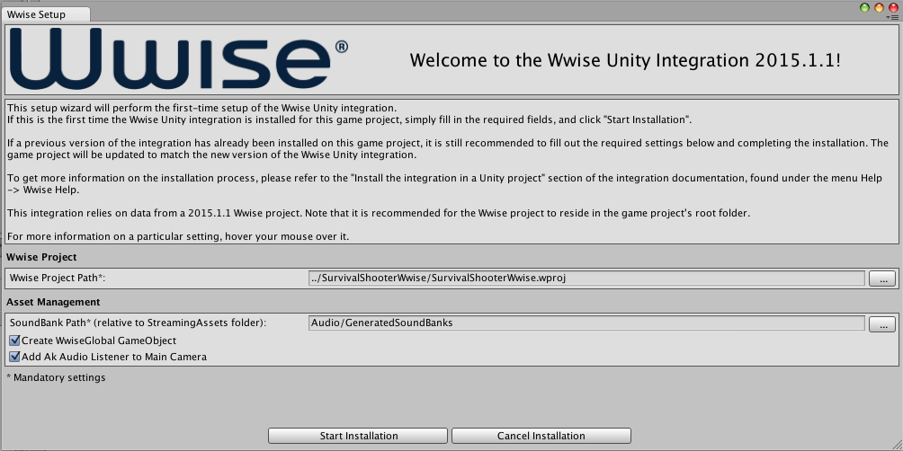

如果一切进行顺利，你会看到`Wwise Setup`屏幕出现了，注意到它已经定位到了我们的 Wwise 工程路径，工程保存在游戏根目录下。我们要保留默认设定，意味着 SoundBank 路径应该维持`Audio/GeneratedSoundBanks`且保证勾选了底下的两个复选框 － Wwise 会自动帮我们把一些游戏对象添加到`Survival Shooter`场景中去。

点击`Start Installation`。

安装结束后，你会看到 Unity 中出现了一个新选项卡叫做`Wwise Picker`。这给了我们一个高层次的视图来看清 Wwise 工程的结构以及目前我们已经创建了的所有内容。


如果你看向场景的`Hierarchy`视图，会注意到一个新对象叫做`WwiseGlobal`，它包括了两个脚本组件，用来处理场景中 Wwise 的初始化和关闭。我们会维持这个对象的默认设定不变。

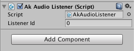

如果你查看一下`Main Camera`对象，也会发现 Wwise 已经将 Unity 的`Audio Listener`对象换成了自己的变体 － `Ak Audio Listener` － 并给了它一个`Listener ID`属性，值为`0`。如果现在就播放这个 Unity 场景，那么你只会听到一片空白。我们需要加载 SoundBank 并在游戏代码中调用`PlayerShoot`Event，这样才能听到`rifle_shot`SFX 对象。

## 在 Unity 中加载 SoundBank

在场景中创建一个空游戏对象并给它取名为`LoadSoundBank`。从`Add Component`的`Wwise`子目录中将`AkBank`脚本加到这个对象上去，并在`Bank Name`属性中选择`MainSoundBank`，保持其它属性不变。


在 MonoDevelop 中打开`PlayerShooting.cs`脚本。在这个脚本中我们会添加对`PlayerShoot`Event 的调用。看到第49行的`Shoot()`调用，这是每次武器打响时被调用的函数，所以这里是调用`PlayerShoot`Event 的一个合适的位置。

将下列代码添加到`Shoot()`下方：

```cpp
AkSoundEngine.PostEvent("PlayerShoot", this.gameObject);
```

`PostEvent`方法需要两个输入参数：被调用 Event 的名称字符串和相关的游戏对象。


现在再播放一次场景，你应该可以听到`rifle_shot`SFX 对象了，并且每次枪声响起时还有微妙的音高变化。

## Wwise 的美妙之处

让我们回头仔细想想刚刚都做了些什么。我们只用一行游戏代码就调用了`PlayerShoot`事件，于是就成功地解除了音频团队和游戏程序员的工作之间的耦合。这意味着只要约定了 Event 的名字，游戏程序员就可以继续编写游戏逻辑，而音频团队则可以集中注意力并行开发最佳的音频体验。假设我们想要改变步枪枪声的音频文件，或者用几个声音来层叠发声，或者甚至给`PlayerShoot`Event 添加别的`Play`动作，比如播放每发枪声后（短暂延迟）的换弹声。这些工作现在都可以不用游戏程序员干预了。音频程序员只需重新生成包含新变动的 SoundBanks，随后游戏音频内容会自动更新。

再回想一下，刚才为`rifle_shot`声音的音高做随机化的过程是相对简单的，想想如果要用 C# 游戏代码来实现相似的效果会需要付出怎样的努力，那样至少需要好几行代码来生成随机数并赋值给`AudioSource`的音高，而且如果我们要尝试不同的音频文件，那么就需要麻烦游戏程序员，发给他们新文件，让他们把新文件加到工程素材中并加到确切的`AudioSource`里面去。相比之下，希望你能体会到使用 Wwise 能为整个团队省下的开发时间。

## 制作更多的声音 ...

### 创建玩家受创声
让我们切回我们的 Wwise 工程，并***按`F5`来将界面布局换为`Designer`。***切换到`Project Explorer`的`Audio`选项卡。

我们现在要添加一些玩家受创时要播放的声音。为了做到这点，我们要使用一种 Wwise 对象叫做 Random/Sequence Container（随机／序列容器）。这个对象会装上多个 SFX 对象，分别代表各种嘟哝声，并在玩家每次受创时随机选择并播放其中之一。导入（`Shift+I`）叫做`damage sounds`的文件夹，当导入装有多个音频文件的文件夹时，Wwise 导入器会自动创建一个 Random/Sequence Container 作为父对象。

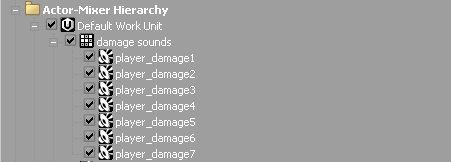

选中`damage sounds`对象，让我们关注一下它的`Property Editor`。我们可以再次用 Wwise Randomizer 为整个容器添加一些随机音高变化。这一次，让我们将音高多样化设成严格为正值 － 我们要设这个值为300音分，这样嘟哝声会有种活泼的花栗鼠叫声的质感。我们还要保证`Play Type`设为`Random	``Shuffle`，并且因为我们不想连续听到同样的嘟哝声，所以我们可以告诉 Wwise 要`Avoid repeating the last``2``played`（避免重复前面2次播放的内容）。我们还要仔细确保`Play Mode`属性设置为`Step`（步进）而不是`Continuous`（连续）。

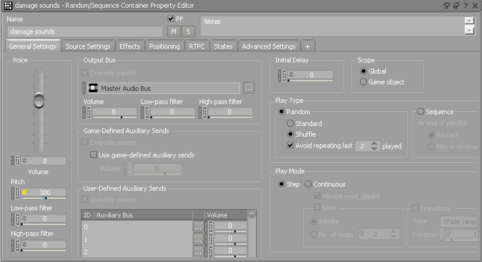

我们要采用和`PlayerShoot`Event 同样的做法，来新建一个 Event 叫做`PlayerDamage`，它包含一个 Action 来在`damage sounds`这个容器对象上调用播放。


### 创建敌人音效

下面，我们要给三种敌人类型配上各自的声音。再次选中`Actor-Mixer Hierarchy`中的`Default Work Unit`，导入（`Shift+I`）`bunny.wav`、`bear.wav`、`hellephant.wav`这几个音频文件。这些会作为三种敌人类型的主要声音。

如果试听一下这三个新 SFX 对象，你会注意到它们其实都是一种怪物嚎叫的变体，并且各自反映了敌人的个头 － 兔子（bunny）声基本上是微喘了一口气，而地狱象（hellephant）的声音更长，更深沉响亮，而且感觉像是大得多的动物。熊（bear）的声音介于上面两者之间。

我们要让这些声音无限循环播放。每个 SFX 对象在`Property Editor`中都有一个`Loop`设定可以启用，但与其对声音一个个地做启用操作，我们不如使用 Wwise 的`Multi-Editor`工具来节约时间。在`Actor-Mixer Hierarchy`中选择全部三个敌人 SFX 对象并***点击`Ctrl+M`来打开`Multi-Editor`窗口***。在`Audio`>`General Settings`>`Loop`下启用`Is Looping Enabled`并点击`OK`。默认设定是无限循环，这符合我们的需求。


既然要循环播放这些声音，那么我们应该保证循环是无缝的，这是指循环的开始和结束应该有同样的音量电平。如果不这么做，那么一次循环播放会结束于某个音量电平而再次起播于不同的电平，造成听得到的噼啪声。针对每个敌人的声音，打开其`Source Editor`（源编辑器），方法是在其`Contents Editor`视图中双击对象名字旁边的波形图标。

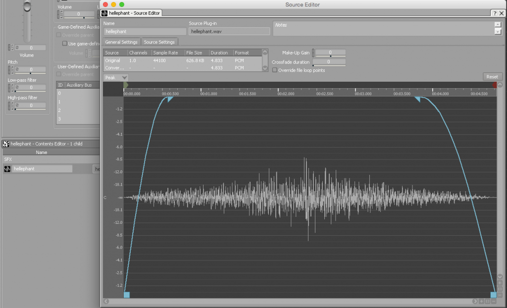

`Source Editor`用来查看音频文件的波形并调整裁剪点和淡变值。我们感兴趣的是调整淡变值，这对应上图中波形视图顶端的蓝色三角。拖动这些三角将调整淡入到满度音量和淡出到无声所需的时间。你会注意到波形的幅度会随这些淡变值自动调整。

## ShareSets 介绍 － 衰减

（2015年12月6日编辑）本教程早期版本中采用在每帧中计算玩家和敌人间的距离，再把距离值作为 RTPC 发给 Wwise 的方法来实现衰减，后来 Audiokinetic 团队很慷慨地教会了我一个更简洁的做法：我们不如让 Wwise 自己为我们来处理距离计算！

第一步是新建三个新 Play Events，每个敌人的 Sound SFX 对象配备一个 Event。我已经给它们取名为`PlayZombear`、`PlayZombunny`、`PlayHellephant`。

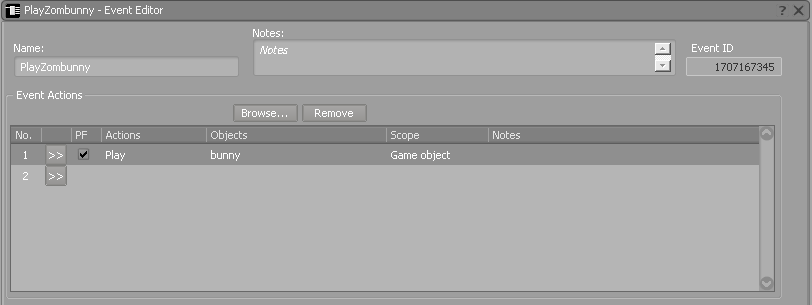

然后，我们要前往`Project Explorer`的`ShareSets`选项卡并新建三个新的 Attnuations（衰减），每个敌人一个。`Max distance`这个参数可能需要缩短 － 我发现设为15比较合适。你大可以按自己的喜好调节曲线形状。例如，如果让“地狱象”的声音在远处也能听见也许是个好的设计，因为这种野兽体积很大而且声音也很吵闹。而如果你希望熊和兔子能潜行突袭玩家，则可以把它们的衰减曲线设为只有在相当近的距离内音量才会攀升至满度。

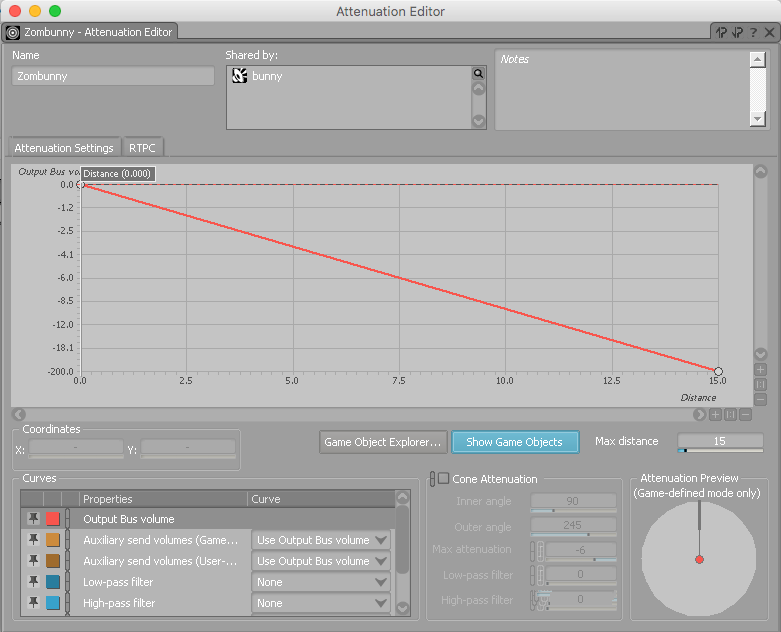

接下来，我们需要把这些 Attenuation 曲线关联到对应的 Sound SFX 对象上去。对每个敌人声音的 Sound SFX 对象，前往其`Sound Property Editor`的`Positioning`选项卡。确保`3D`选项已启用，并在`3D`设定区块中设置相关的`Attenuation`。将`Mode`项更新为`Use ShareSets`。

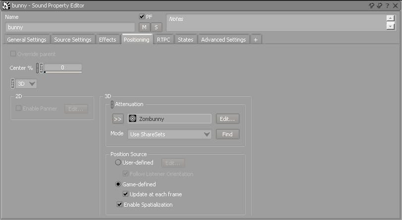

一旦为三种敌人的 Sound SFX 对象指派了 Attenuation，我们就要重新生成 SoundBank 然后切回 Unity。

前往 Unity 工程的`Prefabs`文件夹，对每个敌人的 prefabs 添加一个 Wwise 的`Ak Event`的脚本组件，把脚本加到 prefab 游戏对象上去，并在`Event Name`属性下从我们之前创建的三个 Events 中选取一个合适的。

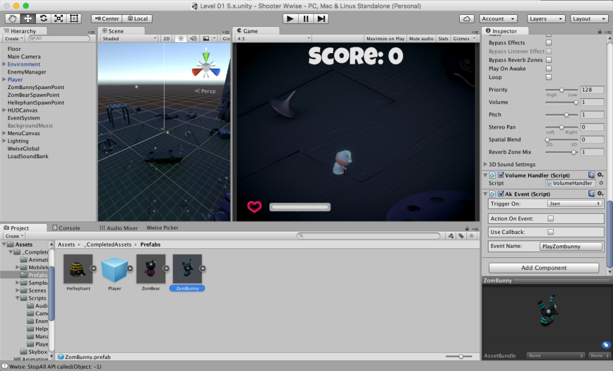

我们也需要把先前创建的`PlayerDamage`事件加入。打开`PlayerHealth.cs`，在`TakeDamage()`中添加以下代码

```csharp
AkSoundEngien.PostEvent("PlayerDamage", this.gemaeObject);
```

保存并播放场景。你现在应该能够听到三个敌人的声音会随着敌人接近玩家而变得更响（`Ak Listener`组件附着在玩家上，这个对象是 Wwse 内部用来计算发送事件的 Game Object 和玩家之间距离的），而且玩家角色每次受创时会发出不同的嘟哝声！

##互动音乐

如果我们能给`Survival Shooter`游戏添加些音乐，让音乐能随着玩家的动作而改变，是不是会很棒？我们可以利用一种 Game Sync 叫做 State（状态）。

简便起见，我们只会用到两个玩家状态来在两个不同的音乐段落之间过渡 － 把一段简单的弦乐合奏乐句用于玩家静止不动的时候，而一段更复杂的弦乐合奏乐句用于玩家移动的时候。音乐节奏为4/4拍、124 BPM、降B小调。Wwise 可以让你以音乐性的方式来做到在这些离散的状态间过渡，也即可以在音乐乐句的节拍点或小节线上触发状态改变，而不是简单的交叉淡变。

切回 Wwise 并***按`F10`将界面布局换到`Interactive Music`***。然后切换到`Project Explorer`的`Game Syncs`选项卡。

我们要新建两个 States（`Idle`，`Movement`）。首先，新建一个 State Group，方法是右击`States`文件夹中的`Default Work Unit`，并给它取名为`MainStateGroup`。然后在这个组里面新建两个 State 子对象并给它们取名为`Idle`和`Movement`。


切换到`Project Explorer`的`Audio`选项卡，并右击`Interactive Music Hierarchy`（互动音乐层级结构）文件夹中的`Default Work Unit`。新建一个 Music Switch Container，并给它取名为`SwitchContainer`。然后右击`SwitchContainer`并新建两个 Music Playlst 类型的子对象，给它们取名为`Music Playlist Idle`和`Music Playlist Movement`。


我们现在要把创建好的 States 和`SwitchContainer`对象关联起来。点击`SwitchContainer`对象并在`Music Switch Container Property Editor`中选中`States`选项卡。点击标记为`Add >>`的按钮然后添加我们创建好的`MainStateGroup`。

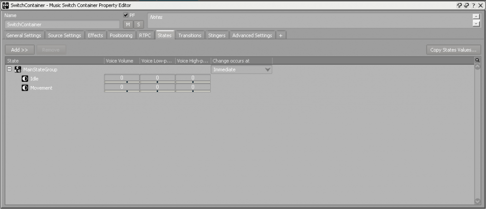

接下来，切换到`Transitions`选项卡。那里应该已经有了一个默认的过渡（Transition），那么选中它。你会注意到被选中的过渡下方有两片区域叫作`Source`（源）和`Destination`（目标）。我们要的是干净利落的音乐性过渡，所以在`Source`下面，我们要选择`Exit source at` **`Next Beat`**。我们还可以添加一个`Fade-out`，淡出时间为1秒，并给0.5秒的偏置，采用对数曲线。做完后你应该会得到这样的结果：


我们也可以给`Destination`区添加`Fade-in`，采用与上述类似的数值。我们还要把`Destination`设定为`Sync to`**`Same time as Playing Segment`**。下面，我们要把`MainStateGroup`添加到`Music Switch Container Association Editor`（关联编辑器）中去，方法是点击标记为`>>`的按钮。最后，我们需要将两个 Music Playlist 子对象从`Interactive Music Hierarchy`中拖到`Music Switch Container Association Editor`中它们对应的 States 上面去。***这是至关重要的一步，而且我发现很容易忘记这一步。***


现在，切换到`Music Swtich Container Property Editor`的`General Settings`选项卡，将`Time Settings`中的`Tempo`更新为124。`SwitchContainer`的`Music Playlist`子对象会自动更新它们的`Tempo`属性来反映出父对象的变化。

现在我们可以把音乐文件添加到 Wwise 工程中去了。最简单的方法是把正确的文件拖放到 Music Playlist 对象上去，这样会自动新建 Music Segment（音乐段落），它里面装有代表音乐文件的 Music Track（音乐轨）。然而，你还是可以手动添加这些子对象的，方法是右击`SwitchContainer`并新建 Music Segment 子对象然后再创建 Music Segment 的 Music Track 子对象。

将`StringPhraseIdle.wav`拖放到`Msic Playlist Idle`，然后将`StringPhraseMovement.wav`拖放到`Msic Playlist Movement`。

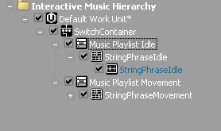

创建了 Music Segment 子对象之后，你还需要把它们添加到 `Music Playlist Editor`中去。选中`Msic Playlist Idle`对象，将`StringPhraseIdle`Music Segment 拖放到`Msic Playlist Editor`中去。将这个`Group`的`Loop Count`（循环次数）设为`Infinite`（无限），方法是单击下箭头。要对`Movement`Music Playlist 也重复一次这个过程。


到了这里，你可以试听一下互动音乐了，方法是选中`SwitchContainer`对象，点击播放，并在`Transport Control`视图中的两个状态之间切换。你会注意到音乐是在节拍点上切换的！

***还差一步 ...***

我们想让音乐在游戏开始时开始播放，所以我们要给`StartGame`事件添加一个 Play 动作，这会让`SwitchContainer`开始播放。***按 F5 键切回 Designer 布局，并把合适的 Action 加到 `StartGame` Event中去。***结果看起来应该是这样的：

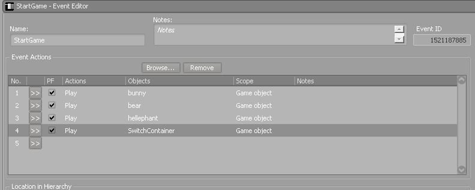

***译注：原文和上图中的`StartGame`事件里有几个问题需要澄清***

* 这个事件需要单独在 Wwise 中创建，原文遗漏了这个说明；
* 为了在游戏场景启动时发送该事件，应该在 Unity 工程中某个`MonoBehaviour`对象的`Start()`方法中调用`PostEvent()`方法，或者利用 Wwise Unity 集成自带的 AkAmbient 脚本组件，将其封装的事件属性`Trigger On`设为`Start`；
* 建议在手动创建`StartGame`事件时不要包括上图中的前面三个 Actions，而只保留音乐播放的 Action，原因是这三个 Actions 对应的三个 SFX 对象已在`创建敌人音效`一节中被设为无限循环播放，所以一旦播放`StartGame`事件，怪物嚎叫声会伴随音乐不断播放，而且前文`ShareSets 介绍 － 衰减`一节中已提到为三种敌人分别创建了各自的事件来播放此处用到的三个 SFX 对象，所以上图中的情况不像是正常的设计。

你需要将`Interactive Music Hierarchy`文件夹添加到 SoundBank 中去。重新生成 SoundBank 并切回 Unity。

我们需要添加一点代码，代码要检查玩家是否移动了。一个简单的办法是把下列代码加到`PlayerMovement.cs`的`Move()`方法中去：

```csharp
if(h != 0 || v !=0)
{
	AkSoundEngine.SetState("MainStateGroup", "Movement");
} 
else 
{
	AkSoundEngine.SetState("MainStateGroup", "Idle");
}
```

变量`h`、`v`代表输入坐标的数值。如果其中任何一个变量的数值不为零，则表示玩家在移动，我们于是对 State 做相应的更新。

如果你现在播放这个场景，应该就可以听到音乐随玩家移动而变化了！

##音频总线和混音：旁链／闪避

既然我们给场景添加了音乐，你可能会发现当玩家开枪时听觉上会开始有点嘈杂。对此，一个可能的解决方案是当玩家开枪时让音乐音量衰减一点。这叫作旁链或者闪避（Ducking）。Wwise 让这种操作变得很简单，方法是创造性地运用音频总线。*译注：原文中作者将 Side-chaining 一词与 Ducking 并用，但实际上只介绍了后者的功能，Wwise 的旁链比闪避功能更丰富，详情请见[官方文档](http://www.audiokinetic.com/download/documents/Wwise_SideChaining_Tutorial.pdf)。*

在`Master-Mixer Hierarchy`（主混音器层级结构）的`Master Audio Bus`下面新建两条子音频总线，取名为`Music Bus`和`Weapon Bus`。

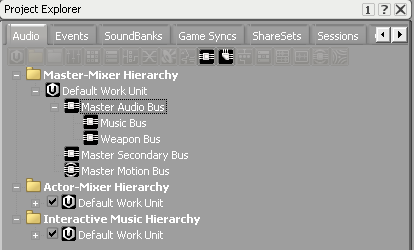

我们要更新`rifle_shot`SFX 对象和`SwitchContainer`对象各自的音频总线。你可以修改两者的`Property Editor`中的`Output Bus`属性。

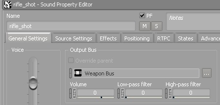

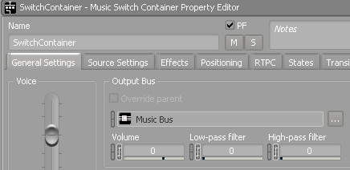

最后，我们要添加闪避，方法是在`Master-Mixer Hierarchy`中选中`Weapon Bus`并将`Music Bus`插入到它的`Auto-ducking`属性中去。我们也可以设置`Auto-ducking`的音量：我选择-9 dB，这意味着当有信号通过`Weapon Bus`的时候`Music Bus`的音量会被衰减9 dB。你也可以设置闪避到达目标音量所需的时间，还可以设计衰减曲线的形状。你应该会得到这样的结果：

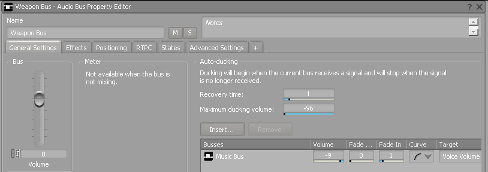

重新生成你的 SoundBank 并在 Unity 中播放场景。你现在应该可以听到当玩家开枪时音乐音量会被压低，随后当停止开枪后又会回升到满度音量。

##结论

本文权当一篇基于 Unity 工程的 Wwise 简介，只触及了 Wwise 的一小部分功能。前文只是介绍了在 Unity Editor 中的操作步骤，当要把最终工程部署到选定的目标平台上去时，还需要把我们生成的 SoundBanks 挪到 Unity 的`StreamingAssets`文件夹下面去（*译注：参见前文`把 Wwise 添加到我们的 Unity 工程`一节配图中的`SoundBank Path`设定*）。感谢阅读！
